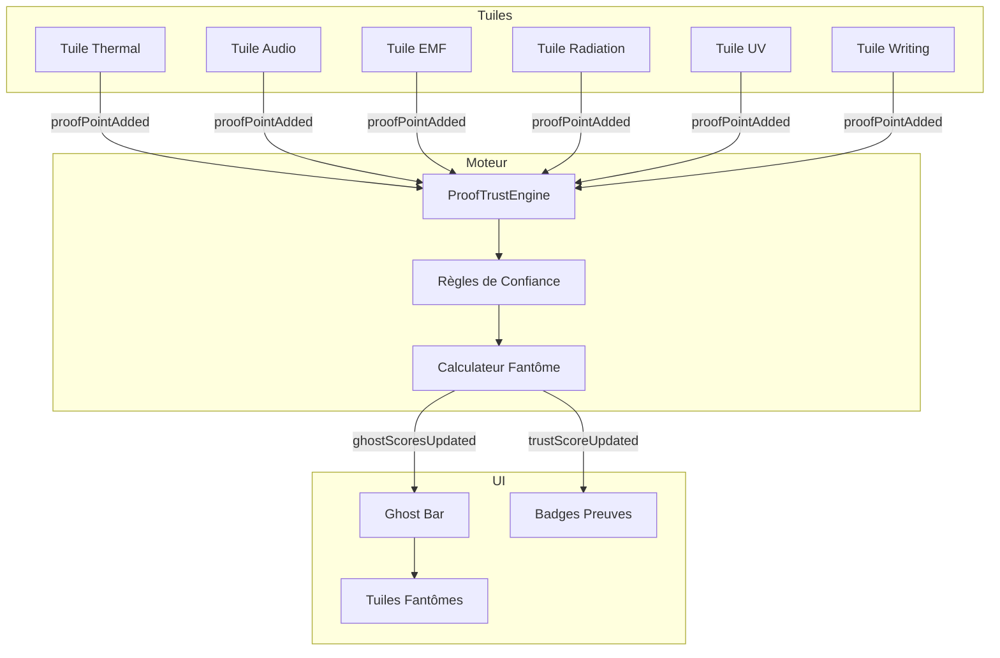

# Plan: Moteur de Confiance & Tuiles Fantômes

## Contexte

Le jeu intègre des **fausses preuves** qui peuvent apparaître en début d'investigation puis diminuer. Les vraies preuves, elles, persistent dans le temps. Le moteur de confiance doit évaluer la fiabilité de chaque preuve pour déterminer le fantôme le plus probable.

---

## 1. Moteur de Confiance (ProofTrustEngine)

### 1.1 Architecture

**Fichier:** `js/engine/proof-trust-engine.js`

Un module singleton qui:
- Collecte les données de toutes les tuiles de preuves
- Calcule le score de confiance pour chaque preuve
- Calcule le score de probabilité pour chaque fantôme
- Émet des événements pour mettre à jour l'UI

### 1.2 Structure de données

```javascript
const state = {
  // Données brutes de toutes les tuiles
  proofData: {
    thermal: { points: [], maxLevel: 4 },
    audio: { points: [], maxLevel: 3 },
    emf: { points: [], maxLevel: 4 },
    radiation: { points: [], maxLevel: 3 },
    uv: { points: [], maxLevel: 3 },
    writing: { points: [], maxLevel: 3 }
  },
  
  // Scores de confiance par preuve
  trustScores: {
    thermal: { level: 'Unsure', score: 0 },
    audio: { level: 'Unsure', score: 0 },
    emf: { level: 'Unsure', score: 0 },
    radiation: { level: 'Unsure', score: 0 },
    uv: { level: 'Unsure', score: 0 },
    writing: { level: 'Unsure', score: 0 }
  },
  
  // Scores fantômes
  ghostScores: [],
  
  currentTime: 0
};
```

### 1.3 Niveaux de confiance

| Niveau | Valeur score | Signification |
|--------|-------------|---------------|
| Guaranteed | 100 | Preuve certaine et stable |
| Confident | 75-99 | Forte probabilité d'être vraie |
| Mixed | 40-74 | Résultats mitigés |
| Unsure | 10-39 | Peu de données ou incertain |
| False | 0 | Preuve fausse/dégradée |

### 1.4 Règles de confiance par type de preuve

#### Thermal (Température)
- **Freezing garanti:** Si un point de niveau 3 ou 4 (température négative) est détecté → **Guaranteed** immédiat
- **Non-freezing:** Analyse la stabilité des niveaux dans le temps
  - 5+ mesures niveau 4 dans les 15 premières minutes → **Guaranteed**
  - 5+ mesures niveau 3+ stables → **Confident**
  - Niveaux décroissants → **False**
  - Niveaux fluctuants → **Mixed**

#### EMF
- **Niveau 4 garanti:** Si un point de niveau 4 (20+ mG) est détecté → **Guaranteed** immédiat
- **Non-max:** Analyse la stabilité
  - 5+ mesures niveau 4 dans les 15 premières minutes → **Guaranteed**
  - 3+ mesures niveau 4 stables → **Confident**
  - Niveaux décroissants → **False**
  - Fluctuations → **Mixed**

#### UV
- **Niveau 1 valide:** Dès qu'un niveau 1 est atteint, c'est une preuve valide
  - 5+ mesures niveau 3 dans 15 min → **Guaranteed**
  - 3+ mesures niveau 3 stables → **Confident**
  - 2+ mesures niveau 2+ stables → **Mixed**
  - Niveau 1 seul → **Unsure**
  - Niveau diminue → **False**

#### Audio
- **Niveau 1 valide:** Dès qu'un niveau 1 est atteint
  - 5+ mesures niveau 3 dans 15 min → **Guaranteed**
  - 3+ mesures niveau 3 stables → **Confident**
  - 2+ mesures niveau 2+ stables → **Mixed**
  - Niveau 1 seul → **Unsure**
  - Niveau diminue → **False**

#### Radiation
- **Niveau 1 valide:** Dès qu'un niveau 1 est atteint
  - 5+ mesures niveau 3 dans 15 min → **Guaranteed**
  - 3+ mesures niveau 3 stables → **Confident**
  - 2+ mesures niveau 2+ stables → **Mixed**
  - Niveau 1 seul → **Unsure**
  - Niveau diminue → **False**

#### Writing
- **Niveau 1 valide:** Dès qu'un niveau 1 est atteint
  - 5+ mesures niveau 3 dans 15 min → **Guaranteed**
  - 3+ mesures niveau 3 stables → **Confident**
  - 2+ mesures niveau 2+ stables → **Mixed**
  - Niveau 1 seul → **Unsure**
  - Niveau diminue → **False**

### 1.5 Algorithme de calcul

```
Pour chaque type de preuve:
  1. Vérifier les preuves "garanties" (Thermal niveau 3+/4, EMF niveau 4)
     → Si trouvé: score = Guaranteed
  
  2. Si pas garanti, analyser l'évolution temporelle:
     a. Calculer le nombre de mesures par niveau
     b. Calculer la durée totale d'observation
     c. Détecter la tendance (croissante, stable, décroissante)
     
  3. Appliquer les règles de confiance:
     - Si >= 5 mesures max dans 15 min → Guaranteed
     - Si >= 3 mesures max stables → Confident
     - Si mesures mitigées → Mixed
     - Si peu de mesures → Unsure
     - Si tendance décroissante → False

  4. Ajuster le score basé sur le nombre total de mesures
```

### 1.6 Méthodes publiques

| Méthode | Description |
|---------|-------------|
| `registerProof(type, points, maxLevel)` | Enregistre les données d'une tuile |
| `calculateTrustScore(proofType)` | Calcule le score de confiance pour une preuve |
| `calculateGhostScores()` | Calcule les scores pour tous les fantômes |
| `getTopGhosts(count)` | Retourne le top N fantômes |
| `getProofTrustLevel(proofType)` | Retourne le niveau de confiance actuel |
| `reset()` | Réinitialise le moteur |

### 1.7 Événements émis

| Événement | Détail |
|-----------|--------|
| `trustScoreUpdated` | `{ proofType, score, level }` |
| `ghostScoresUpdated` | `{ topGhosts: [] }` |

---

## 2. Tuiles Fantômes (GhostTile)

### 2.1 Architecture

**Fichier:** `js/tiles/ghost-tiles.js`

Module qui:
- Affiche les tuiles des fantômes dans la Ghost Bar
- Met à jour les scores en temps réel
- Gère la surbrillance du top 3

### 2.2 Structure HTML ajoutée

Dans `.ghost-bar`:
```html
<div class="ghost-bar-content" id="ghostBar">
  <div class="ghost-tile" data-ghost="banshee">
    <div class="ghost-avatar"></div>
    <div class="ghost-name">Banshee</div>
    <div class="ghost-score">0%</div>
    <div class="ghost-proof-badges">
      <span class="proof-badge audio mixed">A</span>
      <span class="proof-badge emf confident">E</span>
      <span class="proof-badge radiation unsure">R</span>
    </div>
  </div>
  <!-- ... autres fantômes ... -->
</div>
```

### 2.3 Structure des tuiles fantômes

```css
.ghost-tile {
  /* Tuile individuelle */
}

.ghost-score {
  /* Score affiché avec couleur dynamique */
  /* Guaranteed: vert */
  /* Confident: bleu */
  /* Mixed: orange */
  /* Unsure: gris */
  /* False: rouge */
}

.proof-badge {
  /* Badge de preuve avec niveau de confiance */
  /* Couleur basée sur le score de confiance */
}
```

### 2.4 Méthodes publiques

| Méthode | Description |
|---------|-------------|
| `renderGhostTiles(ghosts)` | Rend les tuiles pour tous les fantômes |
| `updateGhostScore(ghostId, score)` | Met à jour le score d'un fantôme |
| `updateProofBadge(proofType, trustLevel)` | Met à jour le badge d'une preuve |
| `highlightTopGhosts(top3)` | Surbrillance du top 3 |
| `reset()` | Réinitialise l'affichage |

---

## 3. Intégration

### 3.1 Flux de données

```
[Clic sur preuve] → [Tuile existante] → addPoint()
                                              ↓
                                        [timerTick]
                                              ↓
                    [ProofTrustEngine] ←→ [GhostTiles]
                         ↓                       ↑
                   [trustScoreUpdated]      [updateGhostScore]
                         ↓                       ↑
                    [ghostScoresUpdated] → [highlightTopGhosts]
```

### 3.2 Modifications des tuiles existantes

Chaque tuile (thermal, audio, emf, radiation, uv, writing) doit:
1. Émettre un événement `proofPointAdded` après `addPoint()`
2. Le détail contient: `{ type, level, time }`

### 3.3 Données des fantômes

Les données des fantômes seront lues depuis `ghost.md` (ou future config JS). Pour l'instant, le moteur utilisera une structure interne.

---

## 4. Plan d'implémentation

### Étape 1: Moteur de confiance (js/engine/proof-trust-engine.js)
- Créer le module singleton
- Implémenter les règles de confiance par type
- Implémenter le calcul des scores fantômes
- Émettre les événements

### Étape 2: CSS pour les tuiles fantômes (css/tile-ghosts.css)
- Styles des tuiles fantômes
- Styles des badges de preuve
- Couleurs des scores
- Animations de transition

### Étape 3: Tuiles fantômes (js/tiles/ghost-tiles.js)
- Rendu des tuiles
- Mise à jour des scores
- Gestion du top 3

### Étape 4: Intégration HTML
- Ajouter la structure des tuiles fantômes dans `index.html`
- Charger les nouveaux scripts

### Étape 5: Connexion aux tuiles existantes
- Modifier chaque tuile pour émettre `proofPointAdded`
- Connecter le ProofTrustEngine aux événements

### Étape 6: Tests et validation
- Vérifier le calcul des scores
- Vérifier la mise à jour en temps réel
- Vérifier le top 3

---

## 5. Diagramme d'architecture



---

## 6. Détails des règles de confiance

### 6.1 Algorithme détaillé pour Thermal

```
Fonction calculerThermalTrust(points, currentTime):
  
  // Vérifier Freezing (niveau 3 ou 4)
  Si existe point.niveau >= 3:
    Retourner Guaranteed
  
  // Analyser la stabilité
  mesuresNiveau4 = filtrer points.niveau == 4
  mesuresNiveau3 = filtrer points.niveau == 3
  mesuresNiveau2 = filtrer points.niveau == 2
  mesuresNiveau1 = filtrer points.niveau == 1
  
  // Calculer la durée
  duration = points[dernier].time - points[premier].time
  
  // Règles Guaranteed
  Si mesuresNiveau4.count >= 5 ET duration <= 900:
    Retourner Guaranteed
  Si mesuresNiveau4.count >= 5:
    Retourner Guaranteed
  
  // Règles Confident
  Si mesuresNiveau4.count >= 3 ET stable(mesuresNiveau4):
    Retourner Confident
  Si mesuresNiveau3.count >= 5 ET stable(mesuresNiveau3):
    Retourner Confident
  
  // Règles Mixed
  Si mesuresNiveau4.count >= 2 OU mesuresNiveau3.count >= 2:
    Retourner Mixed
  
  // Règles Unsure
  Si total des mesures >= 2:
    Retourner Unsure
  
  // Pas assez de données
  Retourner Unsure
```

### 6.2 Algorithme détaillé pour EMF

```
Fonction calculerEMFTrust(points, currentTime):
  
  // Vérifier niveau 4 (20+ mG)
  Si existe point.niveau == 4:
    Retourner Guaranteed
  
  // Analyser la stabilité
  mesuresNiveau4 = filtrer points.niveau == 4
  mesuresNiveau3 = filtrer points.niveau == 3
  mesuresNiveau2 = filtrer points.niveau == 2
  mesuresNiveau1 = filtrer points.niveau == 1
  
  duration = points[dernier].time - points[premier].time
  
  // Règles Guaranteed
  Si mesuresNiveau4.count >= 5 ET duration <= 900:
    Retourner Guaranteed
  Si mesuresNiveau4.count >= 5:
    Retourner Guaranteed
  
  // Règles Confident
  Si mesuresNiveau4.count >= 3 ET stable(mesuresNiveau4):
    Retourner Confident
  Si mesuresNiveau3.count >= 5 ET stable(mesuresNiveau3):
    Retourner Confident
  
  // Règles Mixed
  Si mesuresNiveau4.count >= 2 OU mesuresNiveau3.count >= 2:
    Retourner Mixed
  
  // Règles Unsure
  Si total des mesures >= 2:
    Retourner Unsure
  
  Retourner Unsure
```

### 6.3 Algorithme détaillé pour UV/Audio/Radiation/Writing

```
Fonction calculerPreuveStandard(points, maxLevel, currentTime):
  
  // Toutes ces preuves sont valides dès le niveau 1
  mesuresParNiveau = {1: 0, 2: 0, 3: 0}
  Pour chaque point:
    mesuresParNiveau[point.niveau]++
  
  duration = points[dernier].time - points[premier].time
  
  // Règles Guaranteed
  Si mesuresParNiveau[maxLevel].count >= 5 ET duration <= 900:
    Retourner Guaranteed
  Si mesuresParNiveau[maxLevel].count >= 5:
    Retourner Guaranteed
  
  // Règles Confident
  Si mesuresParNiveau[maxLevel].count >= 3 ET stable(mesuresParNiveau[maxLevel]):
    Retourner Confident
  Si mesuresParNiveau[maxLevel-1].count >= 5 ET stable:
    Retourner Confident
  
  // Règles Mixed
  Si mesuresParNiveau[maxLevel].count >= 2:
    Retourner Mixed
  Si mesuresParNiveau[maxLevel-1].count >= 2:
    Retourner Mixed
  
  // Règles Unsure
  Si total des mesures >= 2:
    Retourner Unsure
  
  Retourner Unsure
```

### 6.4 Fonction utilitaire: stable()

```
Fonction stable(mesures):
  Si mesures.count < 2:
    Retourner False
  
  // Calculer l'écart-type des temps entre les mesures
  temps = extraire_temps(mesures)
  ecartType = calculer_ecart_type(diff(temps))
  
  // Si l'écart-type est faible, les mesures sont régulières
  Retourner ecartType < 120 // 2 minutes
```

---

## 7. Ajustement dynamique des scores fantômes

### Principe
Si une preuve diminue (devient False), les autres preuves gagnent en poids relatif.

### Algorithme
```
Fonction recalculerScoresFantomes():
  preuvesValides = 0
  poidsTotal = 0
  
  Pour chaque type de preuve:
    score = calculerTrustScore(type)
    
    Si score != False:
      preuvesValides++
      poidsTotal += score.score
    
  Pour chaque fantôme:
    scoreFinal = 0
    Pour chaque preuve du fantôme:
      trust = getProofTrustScore(type)
      Si trust != False:
        poids = trust.score / poidsTotal * 100
        scoreFinal += poids
    
    ghostScores[ghost] = scoreFinal / preuvesValides
  
  Retourner trier_par_score(ghostScores)
```

---

## 8. Fichiers à créer/modifier

| Fichier | Action | Description |
|---------|--------|-------------|
| `js/engine/proof-trust-engine.js` | Créer | Moteur de confiance |
| `js/tiles/ghost-tiles.js` | Créer | Tuiles fantômes |
| `css/tile-ghosts.css` | Créer | Styles des tuiles fantômes |
| `index.html` | Modifier | Ajouter structure fantômes + scripts |
| `js/tiles/thermal-tile.js` | Modifier | Émettre `proofPointAdded` |
| `js/tiles/audio-tile.js` | Modifier | Émettre `proofPointAdded` |
| `js/tiles/emf-tile.js` | Modifier | Émettre `proofPointAdded` |
| `js/tiles/radiation-tile.js` | Modifier | Émettre `proofPointAdded` |
| `js/tiles/uv-tile.js` | Modifier | Émettre `proofPointAdded` |
| `js/tiles/writing-tile.js` | Modifier | Émettre `proofPointAdded` |
| `context.md` | Modifier | Ajouter documentation |
