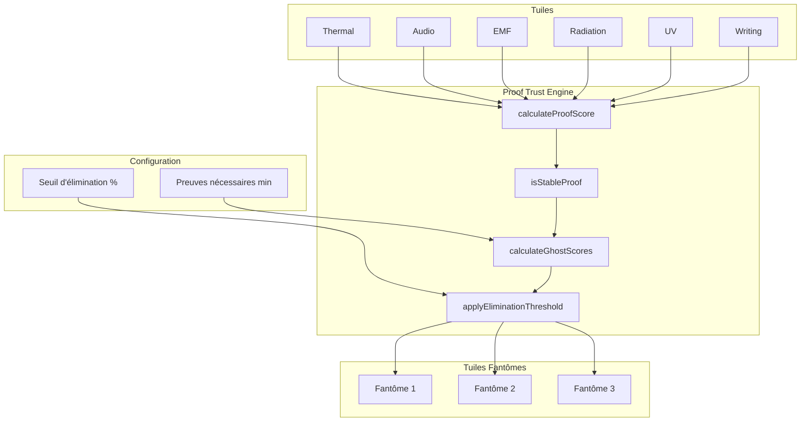

# Plan: Système de Confiance des Preuves (Simplifié)

## Contexte

Actuellement, le système de confiance (`proof-trust-engine.js`) évalue les preuves de manière statique. L'utilisateur demande un système où :
1. L'utilisateur peut configurer le **nombre de preuves nécessaires** pour valider un fantôme
2. Chaque preuve reçoit un **score basé sur sa stabilité et intensité**
3. Les **preuves stables** (niveau maintenu) reçoivent un score élevé
4. Les **preuves en décroissance** reçoivent un score réduit
5. Les fantômes avec score < 50% sont éliminés du calcul

## Objectifs

1. Ajouter des **paramètres globaux** pour configurer le seuil de validation
2. Implémenter un **score de confiance par preuve** basé sur la stabilité
3. Ajouter un **indicateur visuel** sur chaque tuile
4. Permettre l'**élimination des fantômes** dont le score est en dessous du seuil

## Comportement du Score

### Principe
- Le score doit être **identique** que les preuves diminuent immédiatement ou progressivement
- Exemple : 3 niveaux audio puis 1 niveau 1 = même score que 1 niveau 1 seul
- La **température négative** (niveau 3+ thermal) est toujours une preuve garantie

### Calcul du Score par Preuve

| Situation | Score | Niveau |
|-----------|-------|--------|
| 1 preuve unique (quelque soit le niveau) | 100% | Guaranteed |
| Preuve stable (mêmes niveaux répétés) | 85-100% | Confident/Guaranteed |
| Preuve en décroissance (niveaux diminuent) | 0-50% | Mixed/Unsure |
| Preuve absente | 0% | False |

### Exemples

```
Audio: [3, 3, 3, 3] → Stable → Score: 100% → Guaranteed
Audio: [3, 2, 1]    → Décroissant → Score: 0% → False
Audio: [1]           → Unique → Score: 100% → Guaranteed
Thermal: [3]         → Niveau 3+ → Score: 100% → Guaranteed (exemption)
EMF: [2, 2, 2]      → Stable → Score: 85% → Confident
EMF: [3, 2]         → Décroissant → Score: 0% → False
```

## Architecture

### Diagramme de flux



## Modifications Détaillées

### 1. Configuration Globale

**Fichier :** `js/engine/proof-trust-engine.js`

```javascript
var CONFIG = {
    eliminationThreshold: 50  // Seuil d'élimination en %
};
```

### 2. Calcul de Score par Preuve

**Fichier :** `js/engine/proof-trust-engine.js`

```javascript
function calculateProofScore(proofType) {
    var data = state.proofData[proofType];
    if (!data || !data.points || data.points.length === 0) {
        return { level: TRUST_LEVELS.FALSE, score: 0 };
    }

    // Exemption: température négative (niveau 3+ thermal)
    if (proofType === 'thermal' && data.maxLevel >= 3) {
        return { level: TRUST_LEVELS.GUARANTEED, score: 100 };
    }

    // Preuve unique = Guaranteed
    if (data.points.length === 1) {
        return { level: TRUST_LEVELS.GUARANTEED, score: 100 };
    }

    // Vérifier si la preuve est stable
    if (isStableProof(data.points, data.maxLevel)) {
        return { level: TRUST_LEVELS.CONFIDENT, score: 85 };
    }

    // Preuve en décroissance
    if (isDecreasingProof(data.points)) {
        return { level: TRUST_LEVELS.FALSE, score: 0 };
    }

    // Cas mixte
    return { level: TRUST_LEVELS.MIXED, score: 50 };
}

function isStableProof(points, maxLevel) {
    // Toutes les preuves sont au niveau maximum
    for (var i = 0; i < points.length; i++) {
        if (points[i].level !== maxLevel) {
            return false;
        }
    }
    return points.length >= 2;
}

function isDecreasingProof(points) {
    if (points.length < 2) return false;
    var lastLevel = points[points.length - 1].level;
    var firstLevel = points[0].level;
    return lastLevel < firstLevel;
}
```

### 3. Modification de calculateGhostScores

**Fichier :** `js/engine/proof-trust-engine.js`

Utiliser `calculateProofScore()` au lieu de `calculateTrustScore()` pour obtenir le score dynamique :

```javascript
function calculateGhostScores() {
    var proofTypes = ['thermal', 'audio', 'emf', 'radiation', 'uv', 'writing'];
    var proofScores = {};

    // Calculer le score pour chaque type de preuve
    for (var i = 0; i < proofTypes.length; i++) {
        proofScores[proofTypes[i]] = calculateProofScore(proofTypes[i]);
    }

    // Filtrer les preuves éliminées (score < seuil)
    var validProofsCount = 0;
    var totalWeight = 0;
    var proofWeights = {};

    for (var j = 0; j < proofTypes.length; j++) {
        var type = proofTypes[j];
        var score = proofScores[type];
        if (score.score >= CONFIG.eliminationThreshold) {
            proofWeights[type] = score.score;
            validProofsCount++;
            totalWeight += score.score;
        } else {
            proofWeights[type] = 0;
        }
    }

    // ... reste du calcul existant ...
}
```

### 4. Interface de Configuration

**Fichier :** `index.html` - Ajouter dans le header

```html
<div class="proof-config" id="proofConfig">
    <div class="config-item">
        <label for="eliminationThreshold">Elimination threshold:</label>
        <input type="number" id="eliminationThreshold" min="0" max="100" value="50">
        <span>%</span>
    </div>
</div>
```

### 5. Indicateur Visuel sur les Tuiles

**CSS :** Ajouter dans chaque `css/tile-*.css`

```css
.proof-confidence-indicator {
    display: flex;
    align-items: center;
    gap: 4px;
    margin-top: 4px;
    font-size: 11px;
    font-weight: 600;
}

.proof-confidence-bar {
    height: 4px;
    border-radius: 2px;
    flex: 1;
    max-width: 60px;
}

.proof-confidence-bar.score-guaranteed { background: #2ecc71; }
.proof-confidence-bar.score-confident { background: #3498db; }
.proof-confidence-bar.score-mixed { background: #f39c12; }
.proof-confidence-bar.score-unsure { background: var(--text-muted); }
.proof-confidence-bar.score-false { background: #e74c3c; }
```

**JS :** Ajouter dans chaque tuile (`thermal-tile.js`, `audio-tile.js`, etc.)

```javascript
function renderGlobalProof() {
    // ... code existant ...
    
    var score = window.__ProofTrustEngine.getProofScore(proofType);
    var indicator = document.getElementById(proofType + 'ProofIndicator');
    if (indicator) {
        indicator.className = 'proof-confidence-indicator';
        indicator.innerHTML = '<span>' + score.level + '</span>' +
            '<div class="proof-confidence-bar score-' + score.level.toLowerCase() + 
            '" style="width: ' + score.score + '%"></div>' +
            '<span>' + score.score + '%</span>';
    }
}
```

## Ordre d'Implémentation

### Phase 1 : Moteur de Score
1. Ajouter `CONFIG` dans `proof-trust-engine.js`
2. Ajouter `calculateProofScore()`, `isStableProof()`, `isDecreasingProof()`
3. Modifier `calculateGhostScores()` pour utiliser les scores et le seuil d'élimination
4. Exposer `getProofScore()` via l'API publique

### Phase 2 : Interface de Configuration
5. Ajouter le champ de seuil d'élimination dans `index.html`
6. Ajouter le CSS pour le champ de configuration
7. Connecter l'input au `CONFIG`

### Phase 3 : Indicateurs Visuels
8. Ajouter le CSS des indicateurs dans chaque `css/tile-*.css`
9. Ajouter le HTML des indicateurs dans chaque tuile
10. Connecter les indicateurs au moteur via `renderGlobalProof()`

### Phase 4 : Tests
11. Tester le comportement avec différentes combinaisons de preuves
12. Vérifier que le score est identique pour les mêmes preuves (même ordre)
13. Vérifier le comportement au reset

## Fichiers à Modifier

| Fichier | Modification |
|---------|-------------|
| `js/engine/proof-trust-engine.js` | Moteur de score |
| `index.html` | Configuration UI |
| `css/styles.css` | Style configuration |
| `js/tiles/thermal-tile.js` | Indicateur |
| `js/tiles/audio-tile.js` | Indicateur |
| `js/tiles/emf-tile.js` | Indicateur |
| `js/tiles/radiation-tile.js` | Indicateur |
| `js/tiles/uv-tile.js` | Indicateur |
| `js/tiles/writing-tile.js` | Indicateur |
| `css/tile-thermal.css` | Style indicateur |
| `css/tile-audio.css` | Style indicateur |
| `css/tile-emf.css` | Style indicateur |
| `css/tile-radiation.css` | Style indicateur |
| `css/tile-uv.css` | Style indicateur |
| `css/tile-writing.css` | Style indicateur |

## Questions Ouvertes

1. **Le seuil par défaut de 50% est-il approprié ?**
2. **Faut-il un bouton "Reset Config" pour revenir aux valeurs par défaut ?**
3. **Les paramètres doivent-ils être sauvegardés dans localStorage ?**
